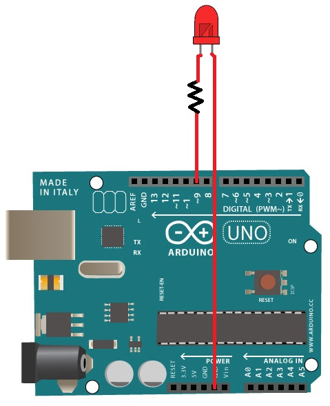

# DimmingLED
Control a Diming LED using LabVIEW and Python

Connect the LED to the Arduino PIN 9 (can be changed through the code)

Either use LabVIEW 2018 or Python 3.x to control the dimming of the LED.
